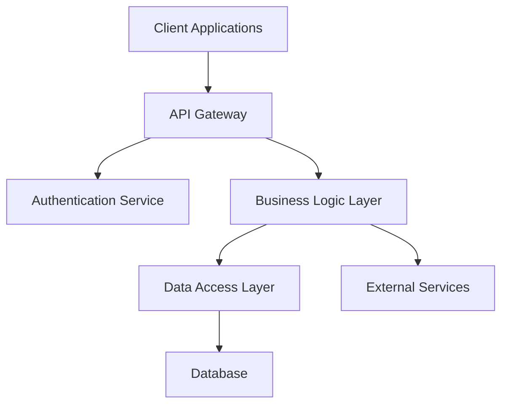

# Design Specification Command

Comprehensive technical design creation from task breakdown to detailed implementation specifications with architecture focus.

## Command

`/design`

## Purpose

Execute the "Tasks to Design" stage of implementation planning, creating detailed technical specifications, architecture diagrams, and implementation guidelines.

## Usage

```
/design [scope] [focus]
```

**Scope:**
- `system` - Complete system architecture design
- `module` - Specific module/component design
- `api` - API design and specification
- `database` - Data model and schema design
- `integration` - System integration design

**Focus Areas:**
- `architecture` - High-level system architecture
- `components` - Component design and relationships
- `interfaces` - API and interface specifications
- `data` - Data models and relationships
- `security` - Security architecture and patterns
- `performance` - Performance optimization design

## Design Framework

### Architecture Design Principles

#### SOLID Architecture Compliance
- **Single Responsibility**: Each component has one clear purpose
- **Open/Closed**: Architecture supports extension without modification
- **Liskov Substitution**: Components are properly substitutable
- **Interface Segregation**: Clean, focused interfaces
- **Dependency Inversion**: High-level modules independent of low-level details

#### Quality Standards Integration
- **Maintainability**: Clear structure and documentation
- **Scalability**: Design supports growth and load increases
- **Testability**: Architecture facilitates comprehensive testing
- **Security**: Built-in security considerations and patterns
- **Performance**: Efficient algorithms and resource usage

### Design Components

#### 1. Architecture Overview
**System Structure:**
- High-level component organization
- Architectural patterns and styles
- Technology stack integration
- Deployment architecture

**Design Patterns:**
- Architectural patterns (MVC, Microservices, Layered, etc.)
- Design patterns (Factory, Observer, Strategy, etc.)
- Integration patterns (API Gateway, Circuit Breaker, etc.)
- Data patterns (Repository, Unit of Work, etc.)

#### 2. Component Specifications
**Component Design:**
- Class definitions and responsibilities
- Method signatures and contracts
- Component relationships and dependencies
- Interface specifications

**Interaction Design:**
- Component communication protocols
- Data flow and message passing
- Event handling and notifications
- Error propagation and handling

#### 3. Data Architecture
**Data Models:**
- Entity definitions and attributes
- Relationship mappings and constraints
- Schema design and normalization
- Data access patterns

**Storage Design:**
- Database selection and configuration
- Indexing strategy and optimization
- Data migration and versioning
- Backup and recovery considerations

#### 4. Integration Architecture
**External System Integration:**
- API specifications and contracts
- Authentication and authorization
- Data synchronization strategies
- Error handling and resilience

**Internal Integration:**
- Module communication protocols
- Event-driven architecture
- Message queuing and processing
- Service discovery and routing

## Design Process

### Stage 1: Requirements Analysis
**Task Breakdown Review:**
1. Analyze approved task list comprehensively
2. Identify design requirements and constraints
3. Map functional requirements to architectural components
4. Establish non-functional requirements (performance, security, scalability)

**Context Integration:**
- Review existing system architecture
- Identify integration points and dependencies
- Assess technology stack compatibility
- Consider organizational constraints and preferences

### Stage 2: Architecture Design
**High-Level Design:**
1. Define overall system architecture and patterns
2. Identify major components and their responsibilities
3. Design component relationships and interfaces
4. Create architectural diagrams and documentation

**Technology Integration:**
- Select appropriate technologies and frameworks
- Design technology stack integration
- Plan deployment and infrastructure requirements
- Consider development and operational constraints

### Stage 3: Detailed Specification
**Component Design:**
1. Define detailed component specifications
2. Design class structures and method signatures
3. Specify interfaces and contracts
4. Plan component testing strategies

**Data Design:**
- Design data models and relationships
- Create database schema specifications
- Plan data access and manipulation patterns
- Design data validation and integrity rules

### Stage 4: Integration Planning
**System Integration:**
1. Design API specifications and protocols
2. Plan external system integration approaches
3. Design error handling and resilience patterns
4. Create integration testing strategies

**Quality Assurance:**
- Review design against quality standards
- Validate SOLID principles compliance
- Assess security and performance implications
- Plan quality assurance and testing approaches

## Design Output Structure

### Architecture Documentation
```markdown
## Design Specification: [System/Module Name]

### Architecture Overview
#### System Architecture
[High-level architectural description]

#### Architectural Patterns
[Applied patterns and rationale]

#### Technology Stack
[Selected technologies and integration]

### Component Design
#### Core Components
[Detailed component specifications]

#### Component Relationships
[Interaction patterns and dependencies]

#### Interface Specifications
[API contracts and protocols]

### Data Architecture
#### Data Models
[Entity definitions and relationships]

#### Schema Design
[Database schema and optimization]

#### Data Access Patterns
[Repository and service patterns]

### Integration Architecture
#### External Integrations
[Third-party system integration]

#### Internal Communication
[Module interaction protocols]

#### Error Handling Strategy
[Resilience and error management]

### Quality Considerations
#### Security Design
[Security patterns and measures]

#### Performance Optimization
[Performance considerations and optimizations]

#### Testing Strategy
[Testing approach and coverage]
```

### Visual Documentation
**Mermaid Diagrams:**
- System architecture diagrams
- Component relationship diagrams
- Data flow illustrations
- Integration mapping
- Sequence diagrams for critical flows

**Example Architecture Diagram:**


## Command Examples

### System Design
```bash
/design system e-commerce-platform    # Complete system architecture
/design architecture microservices    # Microservices architecture design
```

### Component-Specific Design
```bash
/design module user-management         # User management module design
/design api payment-processing         # Payment API specification
/design database order-system          # Order system data design
```

### Specialized Design
```bash
/design security authentication        # Security architecture design
/design performance data-processing    # Performance-optimized design
/design integration third-party-apis   # Integration architecture
```

## Quality Standards

### Architecture Quality
- **Clarity**: Clear architectural vision and communication
- **Consistency**: Consistent patterns and approaches
- **Completeness**: Comprehensive coverage of requirements
- **Correctness**: Technically sound and implementable

### Design Quality
- **SOLID Compliance**: Adherence to design principles
- **Pattern Usage**: Appropriate design pattern application
- **Interface Design**: Clean, focused interfaces
- **Error Handling**: Comprehensive error management

### Documentation Quality
- **Visual Clarity**: Clear diagrams and illustrations
- **Technical Precision**: Accurate technical specifications
- **Implementation Guidance**: Clear implementation direction
- **Maintenance Consideration**: Long-term maintenance planning

## Success Criteria

- Comprehensive technical design specification
- SOLID principles adherence throughout architecture
- Clear component relationships and interfaces
- Integration with existing system architecture
- Quality standards compliance verification
- Implementation-ready design documentation
- Visual architecture representation with diagrams

## Design Validation

### Technical Validation
- Architecture review against requirements
- SOLID principles compliance check
- Technology stack compatibility verification
- Performance and scalability assessment

### Quality Validation
- Security architecture review
- Error handling completeness check
- Testing strategy adequacy assessment
- Maintenance and operational consideration review

## Integration

Works seamlessly with:
- Planning Specialist Agent for requirements integration
- Code Quality Guardian Agent for quality validation
- TDD Coach Agent for testing strategy alignment
- Business Analyst Agent for requirements traceability
- Test Architect Agent for testing architecture
- Memory bank system for design decision persistence
- Implementation workflows for design execution