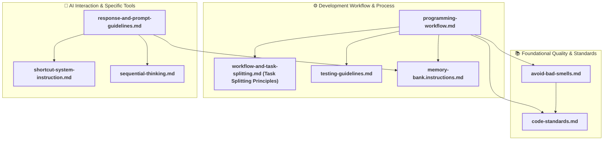

# Instruction Files Relationship Diagram

This document contains a Mermaid diagram illustrating the relationships and dependencies between the various instruction Markdown files located in the `.github/instructions/` directory.

## Diagram

## Diagram Explanation

*   **Boxes**: Represent each instruction Markdown file.
*   **Subgraphs**: Group files by their core functional domain:
    *   `Foundational Quality & Standards`: Contains basic standards for coding and quality.
    *   `Development Workflow & Process`: Includes guidelines for the development lifecycle, task management, and testing.
    *   `AI Interaction & Specific Tools`: Covers AI response structure, shortcut commands, and guidelines for specific tools like the Memory Bank and Sequential Thinking.
*   **Solid Arrows (`-->`)**: Indicate a direct reference or strong logical dependency from one file to another. For example, `programming-workflow.md` (PW) references `code-standards.md` (CS).
*   **`shortcut-system-instruction.md` (SSI)**: This file references multiple other documents extensively based on the specific shortcut command being invoked. To maintain diagram clarity, its broad referential nature is noted in the diagram's comments rather than being fully depicted with arrows.

This diagram aims to provide a better understanding of how these instruction files interrelate and form a cohesive set of guidelines for The AI Assistant.